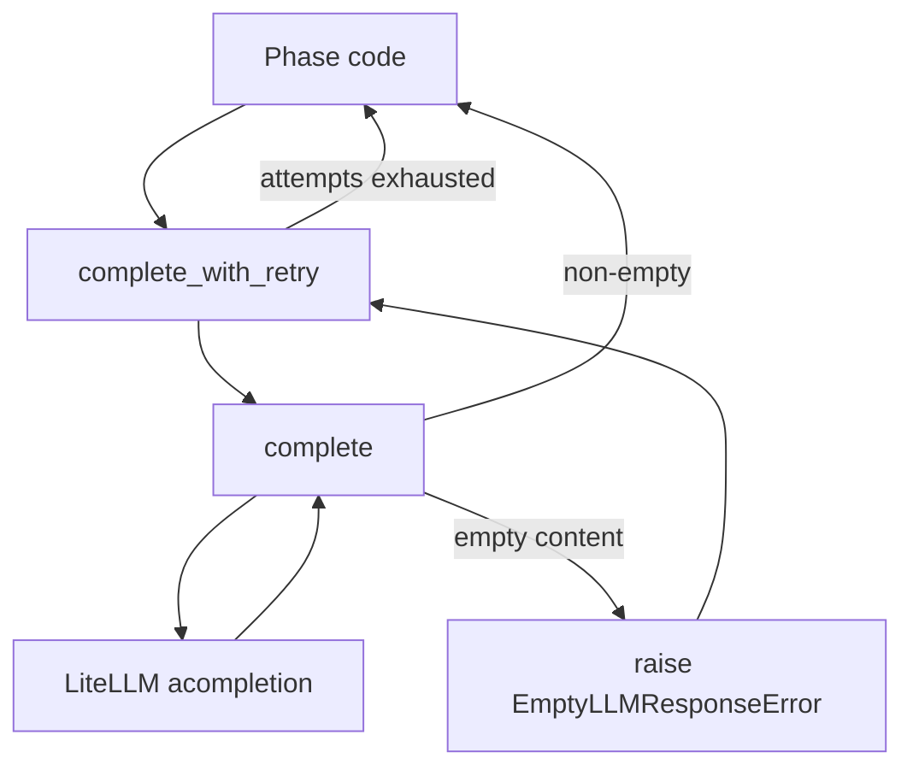

# Chatroom Prompt Fix and Global LLM Guard

## Goals

1. Make Phase 1 prompts unambiguous so each agent clearly produces its own debate turn.
2. Make empty/blank LLM responses a real, typed error at the lowest level so all phases are protected, now and in the future.

## Current Problems

- [`orchestrator/phases/phase1_chatroom.py`](orchestrator/phases/phase1_chatroom.py) replays prior debate messages as `assistant` messages. Some providers treat that as continuation, not as a new agent's turn, so several agents returned empty content.
- [`llm/client.py`](llm/client.py) silently turns missing content into `""`:

```python
return response.choices[0].message.content or ""
```

- Empty content can break Phase 0 JSON parsing, leave Phase 2 briefs blank, or produce an empty final answer in Phase 3 with no clear error.

## Architecture After Fix



## Changes

### 1. Global empty-response guard in [`llm/client.py`](llm/client.py)

Add a typed exception and validate inside `complete()`:

```python
class EmptyLLMResponseError(RuntimeError):
    def __init__(self, model: str):
        super().__init__(f"LLM '{model}' returned empty content.")
        self.model = model
```

In `complete()`:

```python
content = response.choices[0].message.content or ""
if not content.strip():
    raise EmptyLLMResponseError(self._models[tier])
return content
```

Add a thin retry wrapper used by all phases:

```python
async def complete_with_retry(self, messages, tier=ModelTier.STANDARD, max_attempts=2):
    for attempt in range(max_attempts):
        try:
            return await self.complete(messages, tier=tier)
        except EmptyLLMResponseError:
            if attempt == max_attempts - 1:
                raise
```

`complete_json()` should also call `complete_with_retry()` so Phase 0 benefits.

### 2. Phase 1 prompt restructure in [`orchestrator/phases/phase1_chatroom.py`](orchestrator/phases/phase1_chatroom.py)

Replace the multi-`assistant` history with a single `user` instruction:

- `system`: agent persona plus cognitive framework.
- `user`: original question, current turn number, current agent role, formatted transcript so far, and an explicit instruction to write this agent's debate turn.

Special-case the very first speaker: do not require critique of a "previous message" since none exists. Instead, ask for initial analysis with assumptions and risks.

Switch the call to `complete_with_retry()`.

### 3. Apply retry-aware client across phases

Update calls in:

- [`orchestrator/phases/phase0_recruiter.py`](orchestrator/phases/phase0_recruiter.py)
- [`orchestrator/phases/phase1_chatroom.py`](orchestrator/phases/phase1_chatroom.py)
- [`orchestrator/phases/phase2_independent.py`](orchestrator/phases/phase2_independent.py)
- [`orchestrator/phases/phase3_aggregator.py`](orchestrator/phases/phase3_aggregator.py)

Each switches from `llm.complete(...)` / `llm.complete_json(...)` to the retry-aware variants.

### 4. Tests

Update and add:

- [`tests/test_phase1.py`](tests/test_phase1.py): assert no `assistant` history is sent and the transcript is included in the `user` message.
- New unit test for `EmptyLLMResponseError`: empty content raises, non-empty does not.
- New unit test for `complete_with_retry`: succeeds on second attempt, raises after final attempt.
- Adjust existing mocks in [`tests/test_phase1.py`](tests/test_phase1.py), [`tests/test_phase2.py`](tests/test_phase2.py), [`tests/test_phase3.py`](tests/test_phase3.py), [`tests/test_orchestrator.py`](tests/test_orchestrator.py) to keep returning non-empty content so they keep passing.

## Why This Is Best Practice

- Single source of truth for "valid LLM output" lives in the client, not scattered across phases.
- Typed error makes failures explicit and testable.
- Retry policy is centralized and reusable.
- Phase 1 prompt change addresses a real provider quirk without coupling other phases to it.