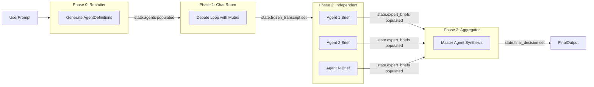

# Decision Room: 4-Phase Hybrid Orchestrator Refactor

## Current State

The project is a flat, 2-file Python CLI chat loop:

- `[main.py](main.py)` -- terminal input loop, maintains a `messages` list
- `[llm_client.py](llm_client.py)` -- single `generate_reply()` function wrapping `litellm.completion()`
- No async, no web server, no agent abstractions, single model config via `.env`

---

## 1. Proposed Directory Structure

```
kfm/
├── main.py                          # Entry point: boots FastAPI or CLI
├── config.py                        # Centralized config (env vars, model tiers)
├── requirements.txt                 # Updated dependencies
├── .env.example                     # Updated env template
│
├── llm/                             # LLM API call layer (isolated)
│   ├── __init__.py
│   └── client.py                    # Multi-tier LiteLLM wrapper
│
├── agents/                          # Agent definitions (isolated)
│   ├── __init__.py
│   ├── models.py                    # AgentDefinition, ExpertBrief dataclasses
│   └── cognitive_framework.py       # Hardcoded cognitive rules for injection
│
├── orchestrator/                    # Orchestrator logic (isolated)
│   ├── __init__.py
│   ├── engine.py                    # SystemOrchestrator: runs the 4-phase pipeline
│   ├── state.py                     # DecisionRoomState Pydantic model
│   └── phases/
│       ├── __init__.py
│       ├── phase0_recruiter.py      # Dynamic Team Assembly
│       ├── phase1_chatroom.py       # Loop Pattern (debate with mutex)
│       ├── phase2_independent.py    # Swarm Pattern (parallel briefs)
│       └── phase3_aggregator.py     # Manager Pattern (final synthesis)
│
└── tests/
    ├── __init__.py
    ├── test_orchestrator.py
    ├── test_phase0.py
    ├── test_phase1.py
    ├── test_phase2.py
    └── test_phase3.py
```

**Three-way separation** as requested:

- `llm/` -- all LLM API calls, nothing else. Supports multiple model tiers (fast/cheap for Recruiter, capable for agents).
- `agents/` -- pure data models for agent identity and output. No orchestration logic.
- `orchestrator/` -- pipeline engine + phase modules. Consumes agents and calls into `llm/`.

---

## 2. State Management Approach

A single `**DecisionRoomState`** Pydantic model acts as the pipeline's source of truth. Each phase reads what it needs, writes its output section, and the orchestrator passes the state forward.




**How data flows between phases for N agents:**

- **Phase 0 -> Phase 1**: The Recruiter populates `state.agents` (a `list[AgentDefinition]` of length 2-4). Phase 1 iterates over this list for turn-taking.
- **Phase 1 -> Phase 2**: When the loop hits the turn limit, the orchestrator calls `state.freeze_transcript()`, which deep-copies `state.debate_transcript` into `state.frozen_transcript`. This is an immutable snapshot. Phase 2 dispatches N parallel tasks, each receiving the same frozen transcript reference -- since no agent mutates it, no lock is needed.
- **Phase 2 -> Phase 3**: Each parallel agent appends its result to `state.expert_briefs` (a `list[ExpertBrief]`). After `asyncio.gather()` resolves, the Master Agent receives the full briefs list.

**Mutex in Phase 1**: An `asyncio.Lock` guards `state.debate_transcript.append()` during the loop. Since it is sequential turn-taking (agent A speaks, then agent B, etc.), the lock is a safety guard ensuring no concurrent writes if the implementation ever changes to allow speculative execution.

**Key design choice**: The state object is **not** passed to the LLM. Only serialized views (transcript as message list, briefs as text) are extracted from it for prompt construction. The state is a backend-only pipeline artifact.

---

## 3. Type Definitions / Interfaces

### Core Data Models (`agents/models.py`)

```python
from pydantic import BaseModel, Field
from enum import Enum

class AgentDefinition(BaseModel):
    """An expert agent generated by the Recruiter in Phase 0."""
    agent_id: str                       # UUID assigned by orchestrator
    role_title: str                     # e.g. "Frontend Security Expert"
    base_persona: str                   # Recruiter-generated persona text
    system_prompt: str = ""             # base_persona + injected cognitive framework
    # system_prompt is computed by the orchestrator after creation,
    # NOT by the Recruiter LLM


class ExpertBrief(BaseModel):
    """An agent's independent conclusion from Phase 2."""
    agent_id: str
    role_title: str
    content: str                        # The agent's final synthesized answer
```

### Message / Transcript (`orchestrator/state.py`)

```python
from pydantic import BaseModel, Field
from enum import Enum
from copy import deepcopy
import uuid

class Phase(str, Enum):
    RECRUITING = "recruiting"
    DEBATE = "debate"
    INDEPENDENT = "independent"
    AGGREGATION = "aggregation"
    COMPLETE = "complete"

class Message(BaseModel):
    """A single message in the debate transcript."""
    agent_id: str
    role_title: str
    content: str
    phase: Phase
    turn_number: int

class DecisionRoomState(BaseModel):
    """Single source of truth for the entire pipeline run."""
    session_id: str = Field(default_factory=lambda: str(uuid.uuid4()))
    user_prompt: str

    # Phase 0 output
    agents: list[AgentDefinition] = []

    # Phase 1 output
    debate_transcript: list[Message] = []
    debate_turn_count: int = 0
    max_debate_turns: int = 3           # Configurable: 3-4

    # Phase 1 -> Phase 2 boundary
    frozen_transcript: list[Message] | None = None

    # Phase 2 output
    expert_briefs: list[ExpertBrief] = []

    # Phase 3 output
    final_decision: str | None = None

    current_phase: Phase = Phase.RECRUITING

    def freeze_transcript(self) -> None:
        """Snapshot the debate transcript for Phase 2 dispatch."""
        self.frozen_transcript = deepcopy(self.debate_transcript)
        self.current_phase = Phase.INDEPENDENT
```

### System Orchestrator (`orchestrator/engine.py`)

```python
import asyncio

class SystemOrchestrator:
    """Runs the 4-phase pipeline from prompt to final decision."""

    def __init__(self, config: OrchestratorConfig):
        self.config = config
        self.llm_client = LLMClient(config)
        self._transcript_lock = asyncio.Lock()

    async def run(self, user_prompt: str) -> DecisionRoomState:
        state = DecisionRoomState(user_prompt=user_prompt)

        # Phase 0: Recruit 2-4 expert agents
        state = await self._phase0_recruit(state)

        # Phase 1: Debate loop (sequential, mutex-guarded)
        state = await self._phase1_debate(state)

        # Freeze transcript at the boundary
        state.freeze_transcript()

        # Phase 2: Independent briefs (parallel, isolated)
        state = await self._phase2_independent(state)

        # Phase 3: Master agent aggregation
        state = await self._phase3_aggregate(state)

        state.current_phase = Phase.COMPLETE
        return state

    async def _phase0_recruit(self, state: DecisionRoomState) -> DecisionRoomState:
        ...  # Call Recruiter LLM, parse JSON, inject cognitive framework

    async def _phase1_debate(self, state: DecisionRoomState) -> DecisionRoomState:
        ...  # Loop 3-4 turns, each agent speaks in order under lock

    async def _phase2_independent(self, state: DecisionRoomState) -> DecisionRoomState:
        ...  # asyncio.gather() dispatches frozen transcript to all agents

    async def _phase3_aggregate(self, state: DecisionRoomState) -> DecisionRoomState:
        ...  # Master Agent synthesizes expert briefs into final decision
```

### LLM Client (`llm/client.py`)

```python
class ModelTier(str, Enum):
    FAST = "fast"           # For Recruiter (Phase 0) -- cheap, low-latency
    STANDARD = "standard"   # For expert agents (Phase 1, 2) and Master (Phase 3)

class LLMClient:
    """Multi-tier LiteLLM wrapper. Isolates all provider API calls."""

    async def complete(
        self,
        messages: list[dict[str, str]],
        tier: ModelTier = ModelTier.STANDARD,
    ) -> str:
        ...  # Selects model based on tier, calls litellm.acompletion()
```

### Cognitive Framework Injection (`agents/cognitive_framework.py`)

```python
COGNITIVE_FRAMEWORK_RULES: str = (
    "CRITICAL RULE: You must identify at least one logical flaw "
    "or unstated assumption in the previous message. Polite agreement "
    "without substantive critique is forbidden. ..."
)

def build_system_prompt(base_persona: str) -> str:
    """Append hardcoded cognitive rules to the Recruiter-generated persona."""
    return f"{base_persona}\n\n{COGNITIVE_FRAMEWORK_RULES}"
```

---

## Key Architectural Decisions

- **Async-first**: All phases use `async/await`. Phase 2 uses `asyncio.gather()` for true parallel dispatch. LLM calls use `litellm.acompletion()` (the async variant).
- **Pydantic state**: Serializable, validatable, and can be logged/persisted to JSON at any phase boundary for debugging or replay.
- **Multi-tier LLM**: The Recruiter (Phase 0) uses a fast/cheap model; expert agents and the Master Agent use a standard-tier model. Both are configurable via `.env`.
- **Cognitive framework is code, not prompt**: The anti-groupthink rules are hardcoded Python strings injected by the orchestrator, never generated or modified by any LLM.
- **FastAPI-ready entry point**: `main.py` will expose an async endpoint (e.g., `POST /decide`) that accepts a user prompt and streams or returns the final decision. The existing CLI mode can be preserved as a flag.

