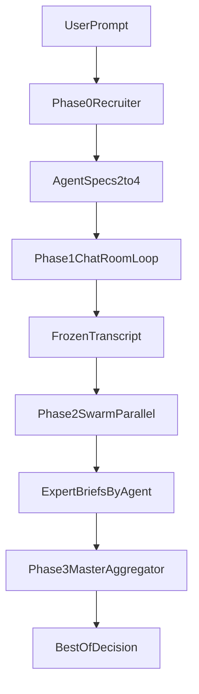

# Decision Room 4-Phase Refactor Plan

## Current Baseline

- Existing code is a minimal Python chat loop: [main.py](main.py) + provider wrapper [llm_client.py](llm_client.py).
- Refactor target is a modular orchestrator with dynamic team assembly, controlled debate loop, parallel independent synthesis, and manager aggregation.

## 1) Proposed Directory Structure

- `decision_room/`
  - `app/`
    - `api/`
      - `routes.py` (HTTP/CLI entrypoints)
      - `schemas.py` (request/response DTOs)
    - `orchestration/`
      - `system_orchestrator.py` (Phase 0-3 coordinator)
      - `phase0_recruiter.py` (dynamic team assembly + JSON validation)
      - `phase1_chatroom.py` (loop debate + mutex turn-taking)
      - `phase2_swarm.py` (parallel isolated briefs)
      - `phase3_manager.py` (master synthesis)
      - `stop_criteria.py` (strict 3-4 iteration policy)
    - `agents/`
      - `models.py` (AgentSpec, ExpertBrief, MasterDecision)
      - `factory.py` (agent instantiation with global rule injection)
      - `prompts/`
        - `cognitive_framework.txt` (hardcoded global rule text)
        - `master_prompt.txt`
    - `state/`
      - `run_state.py` (typed run state container)
      - `transcript_store.py` (in-memory/redis abstraction)
      - `locks.py` (per-run lock map)
    - `llm/`
      - `provider_client.py` (LiteLLM adapter evolution from [llm_client.py](llm_client.py))
      - `json_guard.py` (strict JSON parse/retry/repair policy)
    - `contracts/`
      - `python_types.py` (Pydantic/dataclass contracts)
      - `ts_contracts.md` (mirrored TS interfaces for frontend/client)
    - `utils/`
      - `ids.py`, `clock.py`, `tracing.py`
  - `tests/`
    - `unit/phase0/`, `unit/phase1/`, `unit/phase2/`, `unit/phase3/`
    - `integration/test_full_orchestration.py`
  - `main.py` (thin bootstrap; replace current loop behavior in [main.py](main.py))

## 2) State Management Approach (Phase 1 -> 2 -> 3)

- Use a single `DecisionRunState` object per user request keyed by `run_id`.
- Keep phase outputs immutable once finalized:
  - Phase 1 writes to `live_transcript` under a per-run mutex lock.
  - At loop completion (3-4 iterations), create `frozen_transcript` snapshot (tuple/deepcopy) and disallow further mutation.
  - Phase 2 reads `frozen_transcript` only, executing one async task per agent (`n` in `[2,4]`), producing `expert_briefs: dict[agent_id, ExpertBrief]`.
  - Phase 3 consumes `expert_briefs.values()` and writes one `final_decision`.
- Recommended store pattern:
  - Start with in-process store (`dict[run_id, DecisionRunState]`) for simplicity.
  - Abstract through `TranscriptStore` interface so Redis/Postgres can be added without changing orchestrator logic.
- Concurrency guarantees:
  - `asyncio.Lock` per run for Phase 1 turn writes.
  - `asyncio.gather` for Phase 2 fan-out.
  - Explicit state machine enum to prevent illegal transitions (`ASSEMBLING -> DEBATING -> FROZEN -> SWARMING -> AGGREGATING -> DONE`).




## 3) Interface Definitions (Pseudo-code)

- Python contracts (source of truth) in `contracts/python_types.py`; mirrored TS contracts in `contracts/ts_contracts.md`.

```python
from __future__ import annotations
from dataclasses import dataclass, field
from enum import Enum
from typing import Literal, Protocol

class Phase(str, Enum):
    ASSEMBLING = "assembling"
    DEBATING = "debating"
    FROZEN = "frozen"
    SWARMING = "swarming"
    AGGREGATING = "aggregating"
    DONE = "done"

Role = Literal["system", "user", "assistant", "agent", "master"]

@dataclass(frozen=True)
class AgentSpec:
    agent_id: str
    role_title: str
    base_persona: str
    system_persona: str  # base_persona + injected cognitive framework

@dataclass(frozen=True)
class TranscriptMessage:
    turn_index: int
    agent_id: str | None
    role: Role
    content: str
    phase: Literal["phase1", "phase2", "phase3"]

@dataclass(frozen=True)
class ExpertBrief:
    agent_id: str
    role_title: str
    conclusion: str
    key_points: list[str]
    contradictions_found: list[str]

@dataclass(frozen=True)
class MasterDecision:
    final_answer: str
    rationale: str
    conflicts_resolved: list[str]

@dataclass
class DecisionRunState:
    run_id: str
    user_prompt: str
    phase: Phase
    agents: list[AgentSpec] = field(default_factory=list)
    live_transcript: list[TranscriptMessage] = field(default_factory=list)
    frozen_transcript: tuple[TranscriptMessage, ...] = tuple()
    expert_briefs: dict[str, ExpertBrief] = field(default_factory=dict)
    final_decision: MasterDecision | None = None
    max_loop_iterations: int = 4

class Recruiter(Protocol):
    async def recruit(self, user_prompt: str, min_agents: int = 2, max_agents: int = 4) -> list[AgentSpec]: ...

class DebateAgent(Protocol):
    spec: AgentSpec
    async def take_turn(self, state: DecisionRunState) -> TranscriptMessage: ...
    async def create_brief(self, frozen_transcript: tuple[TranscriptMessage, ...]) -> ExpertBrief: ...

class MasterAgent(Protocol):
    async def synthesize(self, user_prompt: str, briefs: list[ExpertBrief]) -> MasterDecision: ...

class SystemOrchestrator(Protocol):
    async def run(self, user_prompt: str, loop_iterations: int = 4) -> DecisionRunState: ...
```

```ts
export type Phase =
  | "assembling"
  | "debating"
  | "frozen"
  | "swarming"
  | "aggregating"
  | "done";

export interface AgentSpec {
  agentId: string;
  roleTitle: string;
  basePersona: string;
  systemPersona: string;
}

export interface TranscriptMessage {
  turnIndex: number;
  agentId: string | null;
  role: "system" | "user" | "assistant" | "agent" | "master";
  content: string;
  phase: "phase1" | "phase2" | "phase3";
}

export interface ExpertBrief {
  agentId: string;
  roleTitle: string;
  conclusion: string;
  keyPoints: string[];
  contradictionsFound: string[];
}

export interface MasterDecision {
  finalAnswer: string;
  rationale: string;
  conflictsResolved: string[];
}

export interface DecisionRunState {
  runId: string;
  userPrompt: string;
  phase: Phase;
  agents: AgentSpec[];
  liveTranscript: TranscriptMessage[];
  frozenTranscript: TranscriptMessage[];
  expertBriefs: Record<string, ExpertBrief>;
  finalDecision: MasterDecision | null;
  maxLoopIterations: 3 | 4;
}
```

## Implementation Sequence (after plan approval)

- Define contracts and phase state machine first.
- Implement recruiter + strict JSON guard + global rule injection.
- Implement chat loop with mutex and strict turn/iteration guards.
- Implement swarm fan-out and manager aggregation.
- Wire API entrypoint and add integration tests for full 4-phase flow.

