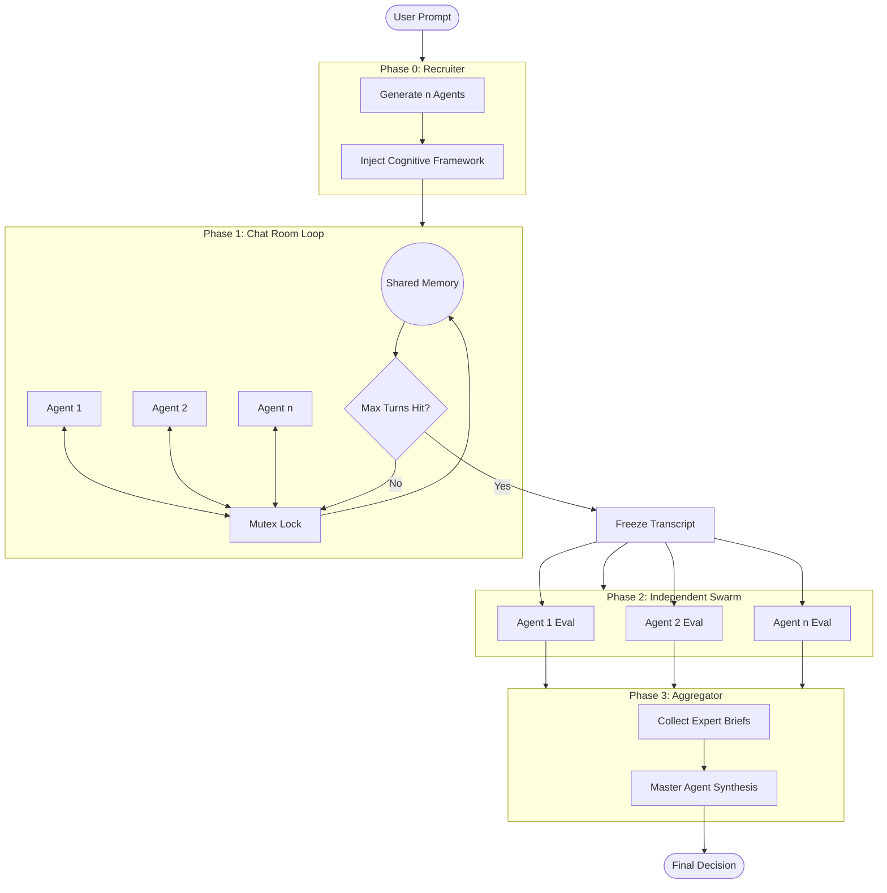

# Refactor Decision Room

## 1. Directory Structure

A clean separation of concerns grouping the orchestrator logic, agent definitions, state management, and LLM integrations.

```text
src/
├── orchestrator/
│   ├── index.ts               # Exposes the main execute function
│   ├── systemOrchestrator.ts  # Main pipeline bridging Phases 0 through 3
│   └── turnManager.ts         # Phase 1 Server-Side Turn-Taking (Mutex Lock)
├── agents/
│   ├── recruiter.ts           # Phase 0: Dynamic team generation
│   ├── expert.ts              # Phase 1 & 2: Chat participation and Swarm brief generation
│   └── master.ts              # Phase 3: Aggregation and synthesis
├── llm/
│   ├── client.ts              # Abstracted LLM API calls (OpenAI/Anthropic)
│   └── prompts.ts             # Hardcoded Cognitive Frameworks & base prompts
├── state/
│   └── decisionContext.ts     # Classes/utils to manage immutable transitions
└── types/
    └── index.ts               # TypeScript Interfaces/Schemas
```

## 2. State Management Approach

State transitions through the 4 phases via a central `DecisionContext` object, utilizing mutability controls:

1. **Phase 1 -> Phase 2 (The Freeze)**:
  During Phase 1 (Loop Pattern), the shared `chatHistory` (array of messages) is strictly mutated via the `TurnManager` (Server-Side Mutex) ensuring no parallel overwrites. Once the 3-4 loop iteration limit is hit, the `chatHistory` array is deep-copied or frozen (e.g., `Object.freeze()`) to become the `Frozen Transcript`.
2. **Phase 2 -> Phase 3 (The Swarm Collection)**:
  The Orchestrator spawns `n` parallel asynchronous tasks (using `Promise.all`). Each task passes the exact same `Frozen Transcript` to an agent. The resulting independent outputs are aggregated into a dictionary/map of `expertBriefs` (`Record<AgentID, Brief>`), which avoids write collisions because each agent writes to its unique key.
3. **Phase 3 (The Manager)**:
  The `master.ts` agent simply reads the `userPrompt` and the fully populated `expertBriefs` dictionary to generate the final synthetic output.




## 3. Pseudo-Code Type Definitions (TypeScript)

```typescript
// --- TYPES ---

export interface AgentConfig {
  id: string;
  roleTitle: string;
  basePersona: string;
  // NOTE: Backend injects the Cognitive Framework during Phase 0
  // finalPrompt = basePersona + '\n\n' + COGNITIVE_FRAMEWORK
}

export interface Message {
  agentId: string;      // ID of the speaking agent
  roleTitle: string;    // E.g., "Frontend Security Expert"
  content: string;
  timestamp: number;
}

// --- STATE MANAGEMENT ---

export interface DecisionContext {
  userPrompt: string;
  agents: AgentConfig[];
  chatHistory: Message[]; 
  frozenTranscript?: ReadonlyArray<Message>; // Created after Phase 1
  expertBriefs: Record<string, string>;      // AgentID -> Brief (Output of Phase 2)
  finalDecision: string | null;              // Output of Phase 3
}

// --- ORCHESTRATOR INTERFACE ---

export interface ISystemOrchestrator {
  /**
   * Phase 0: Calls LLM to generate 2-4 agents, applies global cognitive framework.
   */
  recruitAgents(prompt: string): Promise<AgentConfig[]>;

  /**
   * Phase 1: Manages server-side turn-taking (Mutex) until 3-4 loop iteration limit.
   */
  runChatRoom(context: DecisionContext): Promise<void>;

  /**
   * Phase 2: Freezes transcript, dispatches parallel Swarm execution for briefs.
   */
  runIndependentSwarm(context: DecisionContext): Promise<void>;

  /**
   * Phase 3: Feeds briefs to Master Agent for final synthesis.
   */
  aggregateDecision(context: DecisionContext): Promise<string>;

  /**
   * Main entry point executing Phases 0 -> 3 sequentially.
   */
  execute(prompt: string): Promise<string>;
}
```

